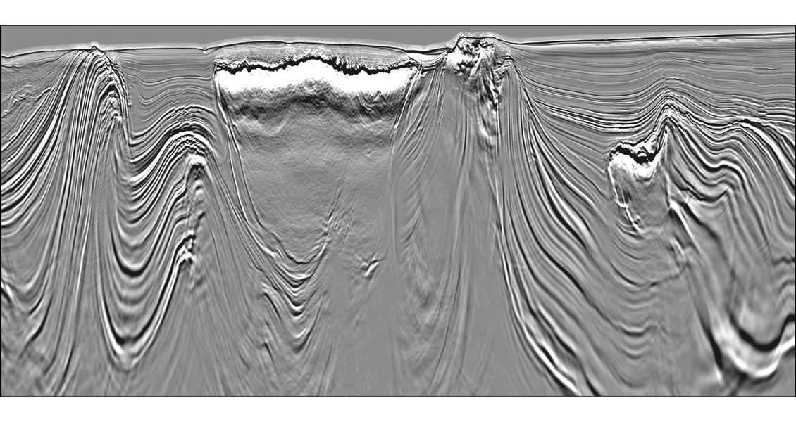
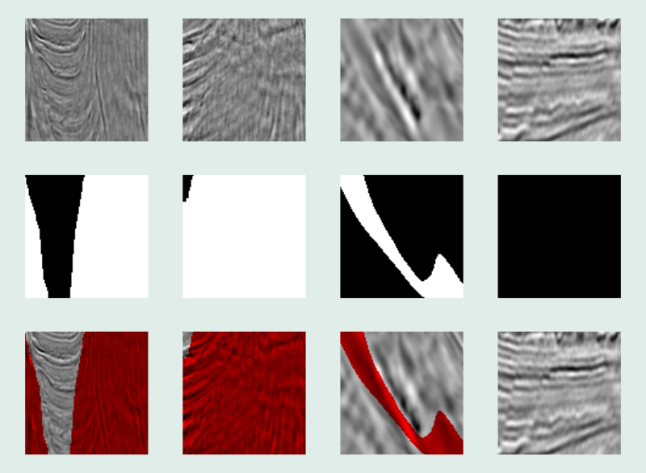
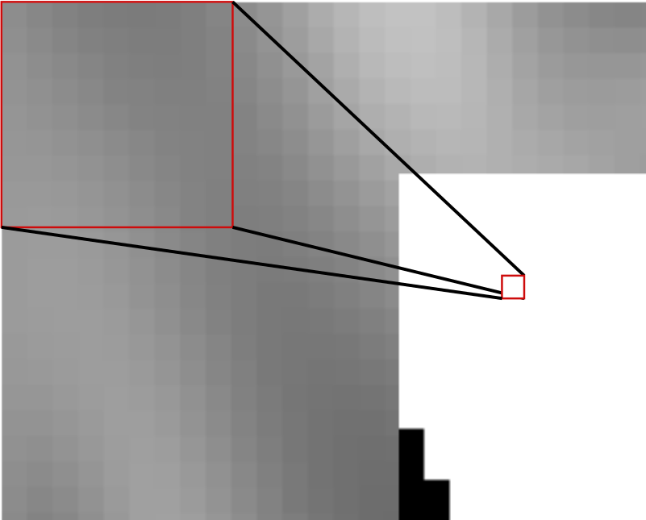
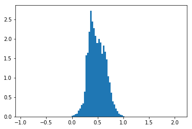
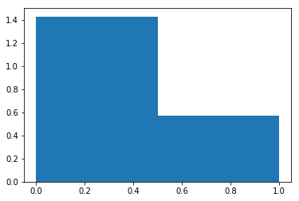
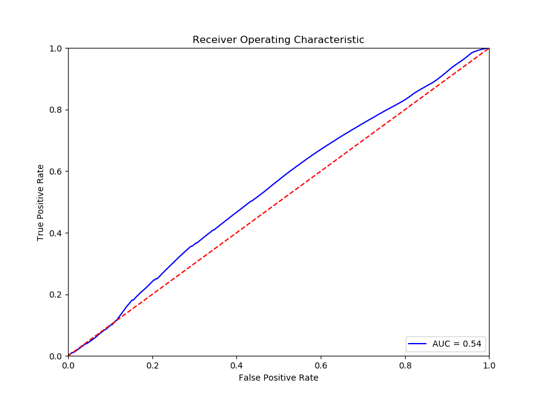
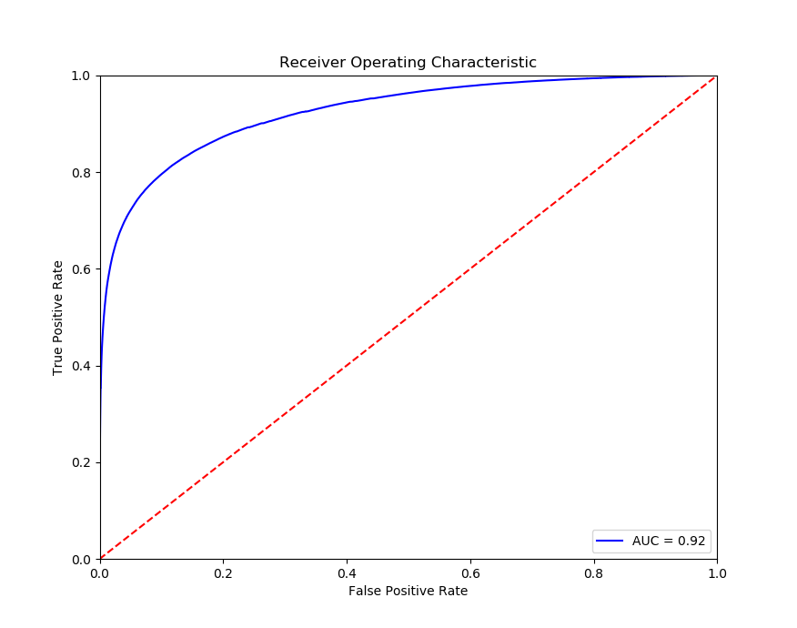
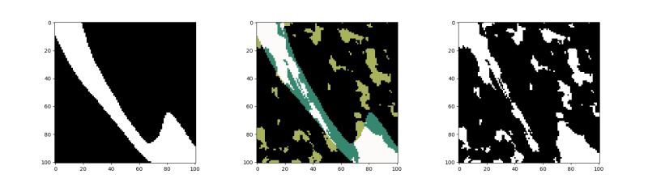

# Pass the Salt

## The Problem

Subsurface salt is a blessing and a curse for Oil and Gas exploration and production. In one hand salt intrusions help creating and sealing oil and gas traps that can be very prolific. In the other hand there are many hazards related to drilling through or near salt domes.


Salt Dome Illustration by the Louisiana Department of Natural Resources.

Reflection Seismic Imaging is used to determine structural and stratigraphic characteristics of the subsurface, it works by recording sound waves as they reflect from the different geological interfaces they found along their path. This technique relies heavily on some properties of the velocities at which the sound travels through the rocks. Salt however, stretches those assumptions reducing the ability for geophysicists to properly image them precisely.


Seismic section where structure is salt dominated. Courtesy of CGG

The goal of this project is to precisely determine what is Salt and what isn't in seismic data.

## The Data

We have been provided with 22,000 101x101 grayscale seismic images and 4,000 masks (or labels) of the same size.

The first step is to QC the **masks**, to do that I decided to blend the masks and the seismic images in order to have context. The first row are the seismic data, the second are the masks 

This is how it looks:




Using the combined images I was able to find and exclude images like this one:


After I manually excluded 194 out of 4000 images. Now I need to convert  the seismic and the masks into the traditional **X** and **y** para poder usar **Logistic Regression** as a base case classifier. 

I will use a window of 9x9 pixels around each position I want to predict.



That converts a single 101x101 input image into a matrix of 10201 data points (rows) with 81 features each. The borders were *odd reflected* padded with 4 extra pixels. The type of padding was selected after testing multiple combinations.

In other words it is redundant by a factor of 81. 

From a sample of the data, we see the distribution of X


And we can also take a look at the classes balance


## First Models

We'll select a subsample of the training data to train a Logistic Regression model and/or a very basic kinda deep MLP model.

To do that I will train the model to predict one pixel from 81 input pixels. and for that I nned to build X and y from the images and the masks, padding the masks according to the size of the input.

## Simple model 1: Logistic Regression

Now that we have X and y, let's try a logistic regression to see how it goes.

### It wasn't pretty...

The problem seems to violate the **Logistic Regression** assumptions, in particular, it does not look like a *linear problem*.



... let's try something a bit smarter...

Using the same **X** and **y** lets train a **Multi Layer Perceptron** to see if we can capture some of the non linearity of the problem.

## MPL


I tried a tradicional MLP with 3 hidden layers of 81, 49, and 25 nodes respectively, ending on a single unit which output is Salt or Not.

```python
    model = Sequential() # sequence of layers
    num_neurons_in_layer_1 = 81  # number of neurons in a layer 
    num_neurons_in_layer_2 = 49  # number of neurons in a layer 
    num_neurons_in_layer_3 = 25  # number of neurons in a layer 
    num_inputs = Xtrn.shape[1] # number of features
    num_classes = 1  # Salt or Not Salt
    model.add(Dense(units=num_neurons_in_layer_1, # First hidden layer same size as inputs
                    input_dim=num_inputs,
                    kernel_initializer='orthogonal',
                    activation='relu'))
    model.add(Dense(units=num_neurons_in_layer_2,
                    input_dim=num_neurons_in_layer_1,
                    kernel_initializer='orthogonal',
                    activation='sigmoid'))
    model.add(Dense(units=1, # it just has to predict Salt or not
                    input_dim=num_neurons_in_layer_2,
                    kernel_initializer='orthogonal',
                    activation='sigmoid')) # keep softmax as last layer
    sgd = SGD(lr=0.01, decay=1e-9, momentum=.5) # learning rate, weight decay, momentum; using stochastic gradient descent (keep)
    model.compile(loss='binary_crossentropy', optimizer='rmsprop', metrics=["accuracy"] )
```

The ROC curve could be better, but it is a great improvement in comparisson with the Logistic Regressor.



Now a random Prediction from the MLP, compared with the actual mask.

Colors:

* **Black** areas are **True Negatives**
* **White** areas are **True Positives**
* **Cyan** areas are **False Negatives**
* **Light Green** areas are **False Positives**




## Future Work

* Test U-Net and Hinton's Capsule-Nets
* Re-structure project to be able to submit jobs to GCP's ML-Engine.
* Feature Engineering (Coherence, maybe).
* More tuning.
